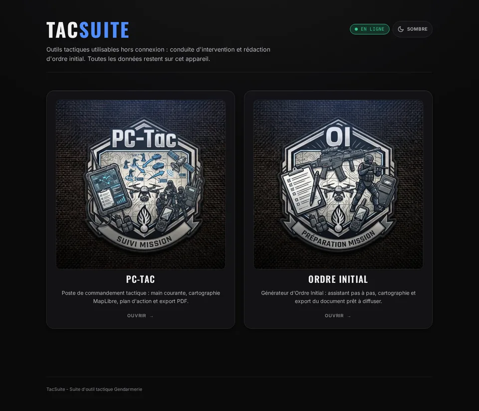

# TacSuite

Outils tactiques qui fonctionnent sans connexion : conduite d'une intervention et rédaction de l'ordre initial.

**Ouvrir TacSuite : https://oxsilaris06.github.io/TacSuite/**



## Les deux applications

**PC-Tac**, poste de commandement tactique :
- main courante horodatée, entrées importantes marquées d'une étoile ;
- fiches des personnes (adversaires, otages, victimes) avec photos annotées ;
- carte : dessin, mesures, carroyage, traces GPX, zones téléchargées pour le hors ligne, suivi d'équipe en temps réel ;
- rapport PDF et synthèse A3, archive `.pctac.zip`.

**Générateur d'OI**, rédaction de l'ordre initial pas à pas :
- huit étapes, de la situation à la finalisation, en version complète ou express ;
- cartographie avec carroyage et captures intégrées au document ;
- PDF prêt à présenter (A4 ou 16:9, clair ou sombre), archive `.oi.zip`.

Un OI exporté s'importe dans PC-Tac.

## Vos données restent sur l'appareil

Pas de compte ni de serveur TacSuite : tout ce que vous saisissez reste dans le navigateur de l'appareil utilisé. Pour transmettre un travail, exportez son archive. Seuls les fonds de carte, la recherche d'adresse et, si vous l'activez, le suivi d'équipe passent par le réseau.

## Hors ligne et sur téléphone

Après une première visite en ligne, TacSuite s'ouvre sans réseau. Pour l'installer comme une application, utilisez le menu du navigateur : « Ajouter à l'écran d'accueil » sur téléphone, « Installer » sur ordinateur. Téléchargez à l'avance les zones de carte utiles.

## Développement

```bash
npm install
npm run dev     # http://localhost:9678
npm run test
npm run build
```

Tests, déploiement et polices du PDF : [docs/DEVELOPPEMENT.md](docs/DEVELOPPEMENT.md).

## Crédits

Portage TypeScript des prototypes [GStart-main](https://github.com/Oxsilaris06/GStart-main). Cartographie : MapLibre GL. Polices du PDF : Oswald et JetBrains Mono (SIL Open Font License 1.1).
